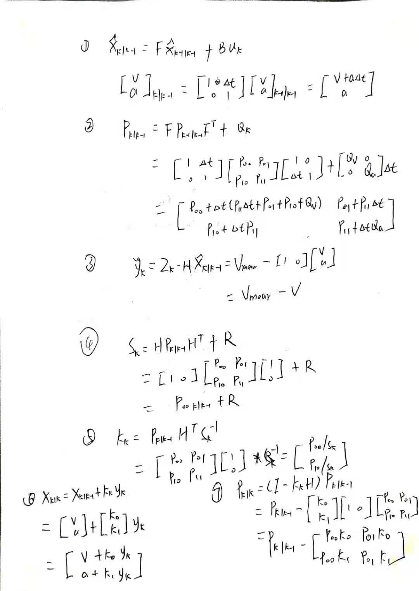

## 1、概述

这是一个针对编码器采集的**速度**的卡尔曼滤波。原汁原味的卡尔曼滤波代码参考:

<https://github.com/TKJElectronics/KalmanFilter>，是关于`mpu6050`之类的`imu`的滤波算法

详细的推到过程参考:

<http://blog.tkjelectronics.dk/2012/09/a-practical-approach-to-kalman-filter-and-how-to-implement-it/>

有关卡尔曼滤波和卡尔曼增益的详细推导过程，目前我所找到的最好的教程参考`B`站：

[CAN神](https://www.bilibili.com/video/BV1ez4y1X7eR) <https://www.bilibili.com/video/BV1ez4y1X7eR>

`kalmanfilter.ods`是用`LibreOffice`做的可视化图表，用`EXCEL`打开就行。

## 2、推导过程

#### 系统状态$x_k$

上一时刻的后验估计状态用${\hat{x}}_{k-1|k-1}$表示；先验状态( `priori state`)用${\hat{x}}_{k|k-1}$表示，先验状态是根据上一个状态估计出的先验值；后验状态(`posteriori state`)用${\hat{x}}_{k|k}$表示；$x_k$代表真实值。

系统`k`时刻的状态为：

$$
\boldsymbol{x}_k = \boldsymbol{F}x_{k-1} + \boldsymbol{B}u_k + w_k
$$

其中` state matrix`：

$$
\boldsymbol{x}_k = \begin{bmatrix} v \\ a \end{bmatrix}_k
$$

其中`v`是速度，`a`是加速度，速度的导数。

**状态转移矩阵**` state transition model`:

$$
\boldsymbol{F} = \begin{bmatrix} 1 & \Delta t \\ 0 & 1 \end{bmatrix}
$$

$w_k$是`0`均值的高斯分布的**过程噪声**：

$$
\boldsymbol{w}_k \sim N\left ( 0, \boldsymbol{Q}_k \right )
$$

$Q_K$是**过程误差协方差矩阵**：

$$
\boldsymbol{Q}_k = \begin{bmatrix} Q_a & 0 \\ 0 & Q_v \end{bmatrix}\Delta t
$$

$Q_k$协方差矩阵依赖于时间，时间越久误差越大，$Q_k$设置的越大，状态估计的噪声会越多，设置对于状态估计的置信度，可以通过更改`Excel`中这两个参数观察曲线变化，关于$Q_k$的值初始化参考[kalman滤波理解三：协

[差矩阵的计算_JK-CSDN博客_误差协方差矩阵](https://blog.csdn.net/u011362822/article/details/95905113)

#### 测量值$z_k$

在**观测空间**`observation `获取测量值$z_k$和真实值$x_k$：

$$
\boldsymbol{z}_k = \boldsymbol{H}x_{k} + v_k
$$

本文中的观测量是**速度**`v`，其中$v_k$是**测量噪声**`measurement noise`，$H$是**观测模型**`observation model`

$$
\boldsymbol{H} = \begin{bmatrix} 1 & 0 \end{bmatrix}
$$

观测噪声符合高斯分布：

$$
\boldsymbol{v}_k \sim N\left ( 0, \boldsymbol{R} \right )
$$

$R$**是测量噪声协方差矩阵**，可通过测一组传感器数据获取或者传感器说明书获取，此处就等于$v$的方差：

$$
\boldsymbol{R} = E \begin{bmatrix} v_k & {v_k}^T \end{bmatrix} = var(v_k)
$$

$R$越小，对于数据的跟随性越好，越大，平滑度越好，更改观察`Excel`表中数据和图。

接下来是两个主要步骤，**预测和校正**

#### 预测

$$
\boldsymbol{\hat{x}}_{k | k-1} = \boldsymbol{F}\hat{x}_{k-1 | k-1} + \boldsymbol{B}{\dot{\theta}_k}
$$

下面是**先验误差状态协方差矩阵**`priori error covariance matrix`:

$$
\boldsymbol{P}_{k | k-1} = \boldsymbol{F}\boldsymbol{P}_{k-1 | k-1}\boldsymbol{F}^T + \boldsymbol{Q}_k
$$

此矩阵代表对于当前估计值的置信度，这里$P$是一个`2x2`矩阵：

$$
\boldsymbol{P} = \begin{bmatrix} P_{00} & P_{01} \\ P_{10} & P_{11} \end{bmatrix}
$$

#### 校正

首先计算测量值与通过先验状态观测值的差，可正可负，叫做`innovation`，革新？

$$
\boldsymbol{\tilde{y}}_k = \boldsymbol{z}_k - \boldsymbol{H}\hat{x}_{k | k-1}
$$

**观测模型$H$ 的作用是，将先验状态${\hat{x}}_{k|k-1}$映射到传感器测量值所在的观测空间**

计算`innovation`协方差矩阵：

$$
\boldsymbol{S}_k = \boldsymbol{H} \boldsymbol{P}_{k | k-1} \boldsymbol{H}^T + \boldsymbol{R}
$$

同理，$H$的作用是将先验误差协方差矩阵映射到观测空间。测量值的噪音越大，则$S$越大，代表我们不太相信新的测量值。

接下来是卡尔曼增益`Kalman gain`，指明我们相信`innovation`的程度：

$$
\boldsymbol{K}_k = \boldsymbol{P}_{k | k-1} \boldsymbol{H}^T \boldsymbol{S}_k^{-1} 
$$

例如我们不太相信`innovation`而是相信先验估计值，则$P$会比较小，$S$会比较大。

如果不知到初**始状态值**可以设置**误差协方差矩阵**为：

$$
\boldsymbol{P} = \begin{bmatrix} L & 0 \\ 0 & L \end{bmatrix}
$$

如果已知初始状态：

$$
\boldsymbol{P} = \begin{bmatrix} 0 & 0 \\ 0 & 0 \end{bmatrix}
$$

然后更新**后验状态**：

$$
\boldsymbol{\hat{x}}_{k | k} = \boldsymbol{\hat{x}}_{k | k-1} + \boldsymbol{K}_k \; \boldsymbol{\tilde{y}}_k
$$

最后更新**后验误差协方差矩阵**`posteriori error covariance matrix`:

$$
\boldsymbol{P}_{k | k} = (\boldsymbol{I} - \boldsymbol{K}_k \boldsymbol{H}) \boldsymbol{P}_{k | k-1}
$$

其中$I$是单位对角矩阵。

## 3、具体公式推导

